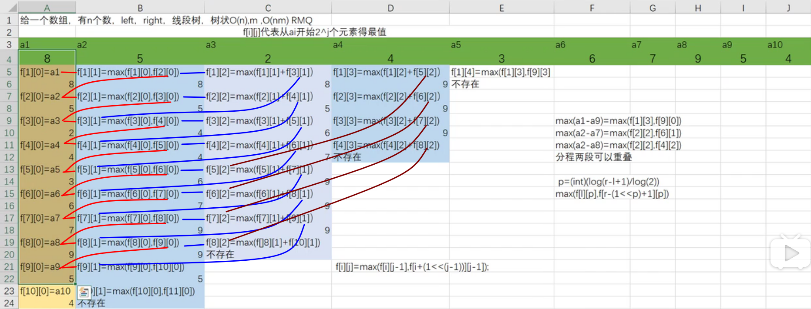

##### ST表[视频链接](https://www.bilibili.com/video/BV1pE411u7Gq?from=search&seid=10433515580160067220)

* 区间查询 $O(1)$

  * ```c++
    Read(L), Read(R);
    		int p = (int)(log(R-L+1)/log(2));
    		printf("%d\n", max(f[L][p], f[R-(1<<p)+1][p]));
    ```

* 预处理 $O(nlogn)$

  * ```c++
    LC = (int)(log(n)/log(2));
    	for(int j=1; j<=LC; j++)
    		for(int i=1; i<=n-(1<<j)+1; i++)
    			f[i][j] = max(f[i][j-1], f[i+(1<<(j-1))][j-1]);
    ```

* $f[i][j]代表a_i开始2^j个元素的最值$

* 预处理的转移方程:$f[i][j] = max(f[i][j-1], f[i+(1<<(j-1))][j-1]);$

* 把一段$[L,R]$拆成两段可重叠的段,取$max$

一列一列的填$f[~][~]$



##### luogu3865模板

> 给定一个长度为$N$的数列，和$M$次询问，求出每一次询问的区间内数字的最大值。

```c++
int f[MAXN][40], LC;
int main() {
	Read(n), Read(m);
	for(int i=1; i<=n; i++) 
		Read(f[i][0]); //初始化f[i][0]
	LC = (int)(log(n)/log(2));
	for(int j=1; j<=LC; j++)
		for(int i=1; i<=n-(1<<j)+1; i++)
			f[i][j] = max(f[i][j-1], f[i+(1<<(j-1))][j-1]);
	int L, R;
	for(int i=1; i<=m; i++) {
		Read(L), Read(R);
		int p = (int)(log(R-L+1)/log(2));
		printf("%d\n", max(f[L][p], f[R-(1<<p)+1][p]));
	}
	return 0;
}

```


##### luogu2251滑动窗口内的最小值[我的代码](/home/majiao/桌面/Link to 刷题/hdu/第一阶段/ST表/luogu2251滑动窗口最小值/)

> 给定$N$个数,对于每一组连续的$M$个数打印最小值

* 单调队列板子题(~~~写过一次,忘记做法了现在~~)
* 用小根堆优化暴力$O(nlogn)$能过
* 线段树板子(~~杀鸡用牛刀~~)
* $ST$表板子,练手(~~对着板子拍代码~~)