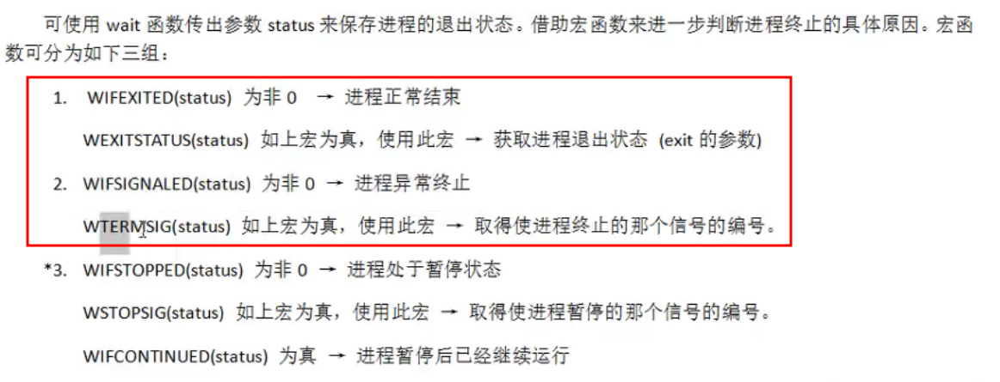

* chdir函数修改当前进程目录
* getcwd获取进程目录,相当于pwd
* mkdir创建目录,没权限无法创建
* rmdir删除**空**目录


##### 重要函数

* opendir打开目录
* readdir读目录
* closedir关闭目录**递归读目录**


##### 文件描述符复制

* dup函数

  * 函数原型

  * ```c++
    int dup(int oldfd); //返回一个fd
    int dup(int oldfd, int newfd);//会先关闭oldfd
    ```
    ​


##### fcntl函数改变以打开文件的属性

> 以只读方式打开text.txt,
>
> 使用fcntl可以修改为可读写


##### 4个重要宏


