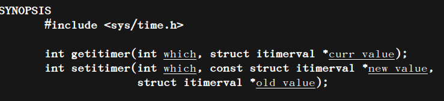

##### 信号

* 基本属性
* 信号4要素

##### 信号由内核发送,且由内核处理

##### 产生信号5种

* kill函数
* alarm函数
* setitimer函数

##### 信号集操作函数

* 信号屏蔽字
* 未决信号集

##### 信号的捕捉

* 注册信号捕捉函数
* sigaction函数(重点)

##### 信号的处理方式

* 执行默认动作
* 忽略(丢弃)     
* 捕捉

> kill -l  查看常用信号
>
> man 7 signal查看信 号文档

##### 以下两个信号不允许捕捉和忽略,只能执行默认动作,甚至不能设置为阻塞

> 9号信号 SIGKILL　杀死进程
>
> 19号信号  SIGSTOP    停止进程

##### alarm函数

> 定时器,
>
> 每个进程只有一个定时器
>
> alarm(0) 可以关闭定时器

##### setitimer函数

> 高精度定时器
>
> 