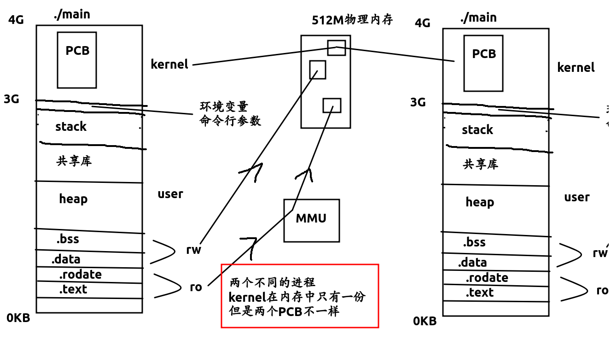
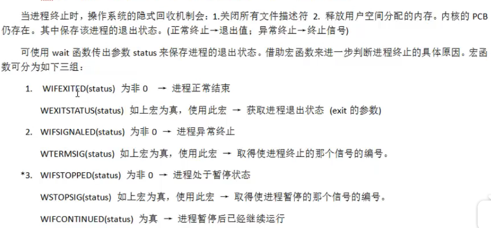
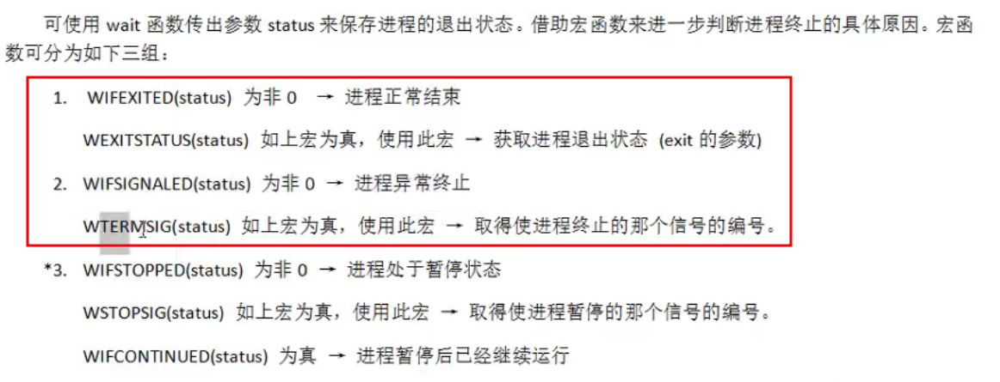

##### 进程相关

我们的虚拟内存长成这个鬼样




* 进程控制块 PCB

> 结构体struct task_struct在头文件
>
> /usr/src/linux-headers-4.15.0-20/include/linux/sched.h
>
> * 进程id, 用pid_t表示,就是一个非负整数
> * 进程状态: 就绪,运行,挂起,停止4种状态
> * 进程切换时需要保存和恢复的一些CPU寄存器
> * 当前工作目录
> * umask掩码
> * 文件描述符表,包含很多指向file结构体的指针
> * 和信号相关的信息
> * 用户id和组id
> * 回话(session)和进程组
> * 进程可以使用的资源上限(Resource Limit)


* 打印环境变量

* ```c++
  extern char** environ;
  for(int i=0; environ[i]; i++)
  	printf("%s\n", environ[i]);

  ```

* 设置环境变量

* ```c++
  int setenv(const char *name, const char *value, int overwrite);
  ```


* ##### fork创建子进程

* ```c++
  pid_t fork(void) //返回子进程的pid
  ```

* fork会返回两个值,并从fork处接着运行代码,而不是从头运行

* * 父进程的fork()返回子进程pid(大于0)
  * 子进程的fork()返回0 表示成功
  * 下面的代码可以通过返回值判断是父进程还是子进程

```c++
//创建一个子进程 并判断是父进程还是子进程
pid_t pid = 0;
printf("father print\n");
pid = fork(); //子进程会从这一行以下直接执行
if(pid == 0) //返回0 代表当前进程是子进程
  printf("chl go on. pid:%d\n", getpid());
else 
  printf("father go on. pid:%d\n", getpid());
```

```c++
//循环创建5个子进程
int i;
pid_t pid;
for(i=0; i<5; i++) { //循环创建5个子进程
  pid = fork();
  if(pid == 0) break; 
}
if(i < 5) {
  sleep(i);
  printf("I'am %d child , pid : %d\n", i+1, getpid());
} else {
  sleep(i);
  printf("I'am father\n");
}
```


### 以下为重点

##### 父子进程相同点

* 全局变量,  .data,  .text, 栈, 堆, 环境变量, 用户id, 宿主目录
* 进程工作目录, 信号处理方式, 


##### 父子进程不同点

* 进程id,   fork()返回值,  父进程id,  进程运行时间,  定时器, 
* 未解决信号集

> 修改父进程里的全局变量val无法改变子进程里的val


> 面试题 : 
>
> fork()时是把父进程完全拷贝一份吗?
>
> 答: 不是,父子进程遵循**读时共享,写时复制**的原则,
>
> ​     且父子共享 **1. 文件描述符, 2. mmap建立的映射区**


##### exec函数族

```c++
//共有6种exec开头的函数
//不适用环境变量,要写绝对路径
int execl(const char* path, const char*arg,...);
pid_t pid;
pid = fork();
if(pid == -1) {
  perror("error\n");
  return 0;
} else if(pid > 0) { //父进程
  sleep(1);
  printf("father\n");
} else {
  //最后一个参数必须是NULL
  //不用环境变量,要写绝对路径
  execl("/bin/ls", "ls", "-l", "-a", NULL);
}
```

```c++
//使用环境变量,不用写绝对路径
int execlp(const char*file, const char*arg,...)
pid_t pid;
pid = fork();
if(pid == -1) {
  perror("error\n");
  return 0;
} else if(pid > 0) { //父进程
  sleep(1);
  printf("father\n");
} else {
  //最后一个参数必须是NULL
  execlp("ls", "ls", "-l", "-a", NULL);
}
```

练习:

1. 将当前系统的进程信息打印到文件里面[代码](/home/majiao/桌面/笔记/linux网络学习笔记/进程相关代码/exec函数族/execlp执行ps并输出到文件.cpp)

   ```c++
   int fd = open("out", O_WRONLY|O_CREAT|O_TRUNC, 0644);
   if(fd < 0) {
     perror("open error:");
     return 0;
   }
   dup2(fd, STDOUT_FILENO);
   //execlp没有成功返回值
   execlp("ps", "ps", "ax", NULL); 
   //execlp成功后hello不会被执行打印
   printf("hello\n"); 
   //close(fd); //同上,所以close(fd)没意义
   ```

   ​

2. 回收僵尸进程

   * wait函数

   * * 阻塞等待子进程退出
     * 回收子进程的资源

   * ```c++
     pid_t pid, wpid;
     pid = fork();
     if(pid == 0) {
       printf("---child, my father id:%d, going to sleep 10s\n", getppid());
       sleep(10);
       printf("--------child die-------\n");
     } else if(pid > 0) {
       wpid = wait(NULL); //用wait阻塞子进程 并收尸 
       if(wpid == -1) {
         perror("wait error:");
         return 0;
       }
       while(1) {
         printf("I am father, pid:%d, sonid:%d\n", getpid(), pid);
         sleep(1);
       }
     }
     ```

   * 


##### 4个重要宏



* 第一个的使用方法[代码](/home/majiao/桌面/笔记/linux网络学习笔记/进程相关代码/exec函数族/execlp3使用wait和WIFEXITED宏等待子进程退出.cpp)

* ```c++
  pid_t pid, wpid;
  pid = fork();
  if(pid == 0) {
    printf("---child, my father id:%d, going to sleep 10s\n", getppid());
    sleep(3);
    printf("--------child die-------\n");
    return 99;
  } else if(pid > 0) {
    int status; 
    wpid = wait(&status); //用wait阻塞子进程 并收尸 
    if(WIFEXITED(status)) { //取得子进程结束的返回值
      printf("child exit status:%d\n", WEXITSTATUS(status));//WEXITSTATUS宏
    }
    if(wpid == -1) {
      perror("wait error:");
      return 0;
    }
    while(1) {
      printf("I am father, pid:%d, sonid:%d\n", getpid(), pid);
      sleep(1);
    }
  }
  ```

* 第二个使用方法[代码](/home/majiao/桌面/笔记/linux网络学习笔记/进程相关代码/exec函数族/execlp4使用WIFSIGNALED获得子进程异常信号.cpp)

* ```c++
  pid_t pid, wpid;
  pid = fork();
  if(pid == 0) {
    printf("---child, my father id:%d\n", getppid());
    printf("--child die(try div 0)-----\n");
    int a = 10;
    a = a / 0; //除零异常,内核会抛出"8"信号signal
    return 99;
  } else if(pid > 0) {
    int status; 
    wpid = wait(&status); //用wait阻塞子进程 并收尸 
    if(WIFEXITED(status)) { //取得子进程结束的返回值
      printf("child exit status:%d\n", WEXITSTATUS(status));
    }
    if(WIFSIGNALED(status)) { //取得子进程退出信号 
      printf("child kill by: %d\n", WTERMSIG(status));
    }
    if(wpid == -1) {
      perror("wait error:");
      return 0;
    }
    while(1) {
      printf("I am father, pid:%d, sonid:%d\n", getpid(), pid);
      sleep(1);
    }
  }
  ```

* ​


##### waitpid函数的使用

```c++
pid_t waitpid(pid_t pid, int *wstatus, int options);
```

* 可以用来回收指定pid的子进程

* 参数:

* * **大于０回收指定pid的子进程**
  * **$-1$回收任意子进程(相当于wait)**
  * 0 回收和当前调用waitpid一个组的所有子进程
  * 小于$-1$,表示所有组号为$-Ｘ$的

* 参数3: WNOHANG可以不阻塞父进程,父进程轮巡子进程回收

* ```c++
  //重要
  int i, n = 5;
  pid_t p, chl3, wpid;
  for(i=0; i<n; i++) {
    p = fork(); //创建5个子进程
    if(p == 0) break;
    chl3 = i==1 ? p : chl3;
  }
  printf("i=%d\n", i);
  if(n == i) {
    sleep(n);
    printf("i am parent, pid:%d", getpid());
    //waitpid(chl3,NULL,0);//0代表阻塞等待chl3子进程
    //waitpid(-1, NULL, 0); //-1代表 等待所有子进程
    do { 
      //WNOHANG子进程还在运行就返回0
      wpid = waitpid(-1, NULL, WNOHANG);
      if(wpid > 0) n --;
      sleep(1); //轮巡回收子进程
    } while(n > 0);
  } else {
    sleep(i);
    printf("i am %dth chl pid:%d, gpid:%d\n",
           i, getpid(), getgid());
  }
  ```


注意: 一次wait或waitpid调用只能回收一个子进程

作业 : 父进程fork出3个子进程，三个子进程一个调用ps命令,

一个调用自定义程序(正常), 一个调用自定义(段错误)程序,

父进程使用waitpid回收子进程.


```c++
//父进程等待所有子进程结束
int n = 4, i;
pid_t pid[n];
for(i=1; i<=n; i++) {
  pid[i] = fork();
  if(pid[i] == 0) {
    printf("child try sleep 10\n");
    sleep(10);
    break;
  }
}
if(i >= n) {
  for(int j=0; j<n; ++j) {
    wait(NULL);
    printf("father finish\n");
  }
}
```

