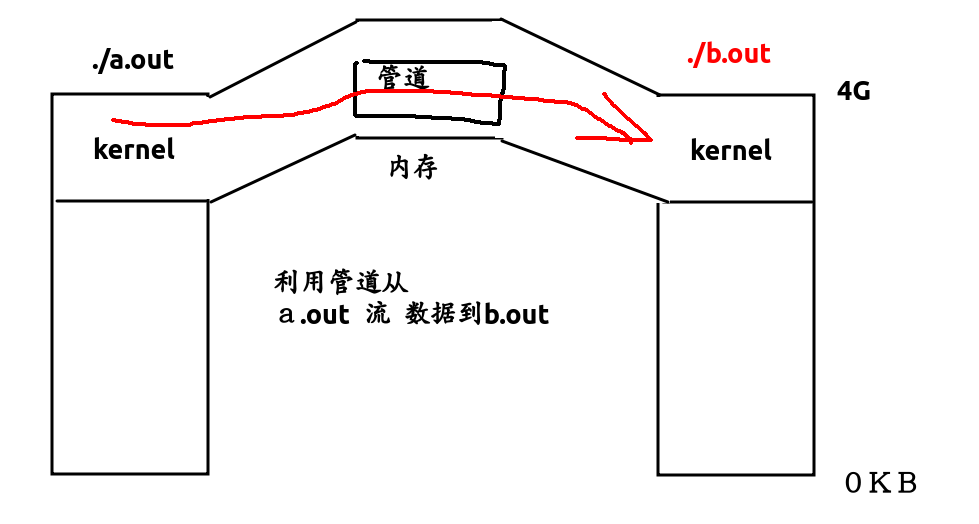
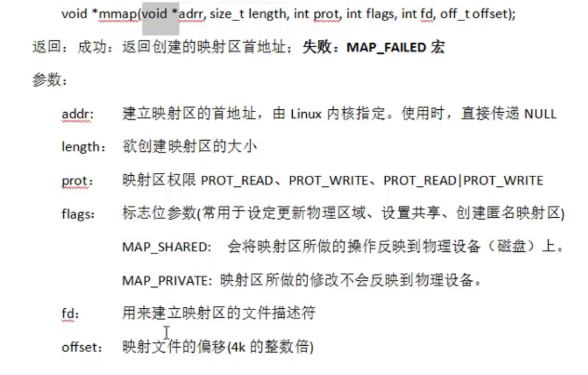
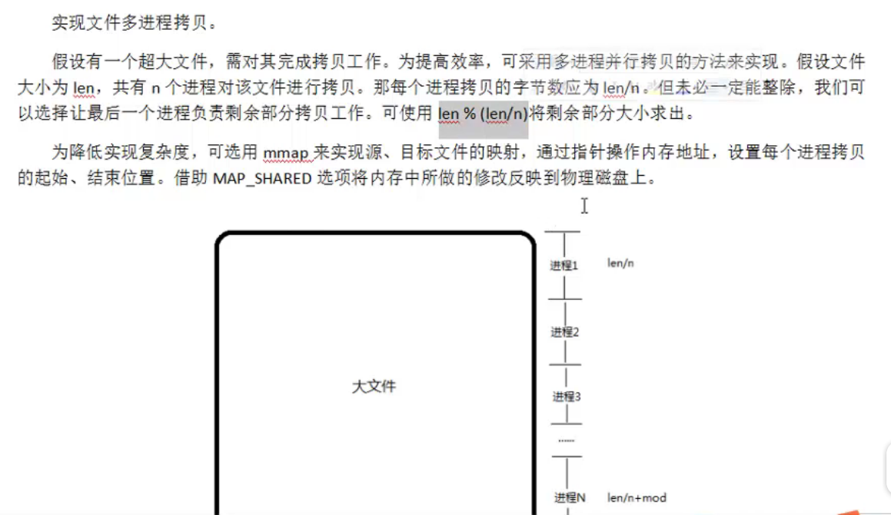

##### 进程通信 ipc

* 管道 (使用最简单   队列)

* 信号 (开销最小)

* 共享内存 (无血缘关系)

* 套接字 (最稳定)

* 文件 (被淘汰了的方式)

  * 7种文件类型
  * -文件
  * d 目录
  * l 符号链接
  * s 套接字 (伪文件)
  * b 块设备 (伪文件)
  * c 字符设备 (伪文件)
  * p 管道 (伪文件)

* ##### 管道  (数据单向流动   半双工   只能在有公共祖先的进程使用)

* * pipe  (默认大小4KB  底层是环形队列)
  * fifo   必须掌握  (非血缘关系)
  * mmap   必须掌握
  * ulimit -a 查看管道的默认大小
  * fpathconf函数可以查看管道缓冲区大小(不重要)

* 如下图

* 

* 管道父子进程通信[代码](/home/majiao/my_mount/Xubuntu_Work_Space/From_Xubuntu/codeTest_2019_2_21/刷题/笔记/linux网络学习笔记/进程相关代码/pipe管道)

* ```c++
  int fd[2];
  pid_t pid;
  //使用pipe(int* fd)创建管道
  // fd[0]是读端R,  fd[1]是写端W
  int ret = pipe(fd);
  //要使得数据单向流动 即从父进程写入子进程
  //就要关闭父进程的读, 关闭子进程的写
  pid = fork();
  if(pid == 0) { //子进程关闭写
    close(fd[1]);
    char buf[1024] = { 0 };
    printf("child try read\n");
    int len = read(fd[0], buf, sizeof(buf));
    printf("child buf[] = %s\n", buf);
  } else { //父进程关闭读
    close(fd[0]);
    sleep(5);
    const char* str = "hello pipe\n";
    printf("father try write: %s\n", str);
    write(fd[1], str, strlen(str));
  }
  ```

* ​


##### FIFO 命名管道 重要

* 命令: mkfifo, 函数: mkfifo


##### mmap共享内存  重要

* 磁盘文件映射到内存
* 父子进程，血缘关系进程　通信
* 匿名映射区




```c++
ftruncate(fd, file_len); //改变文件大小
void* ptr = mmap(NULL, len, PROT_READ|PROT_WRITE, MAP_SHARED, fd, 0);
参数:
MAP_SHARED  修改内存时级联更新到文件
MAP_PRIVATE  不更新到文件
if(ptr == MAP_FAILED) //调用mmap()失败
unlink("file_name") //删除临时目录项,当没有进程使用这个文件后，文件自动被删除
```

##### mmap常见到的问题

1. 可以open的时候O_CREAT一个新文件来创建映射区吗?

   * 可以

2. 设已有代码ptr=mmap(...),如果ptr++了后,使用munmap

   会出问题吗？

   * 会, ptr不能改变,不然就凉凉

3. 如果open文件时只有"读"的权限(O_RDONLY),但是在

   mmap(..)是指定了可"读写"权限(PROT_READ|PROT_WRITE)

   会报错吗?

   * 会报错,爆权限不足

4. 如果mmap(...,MAP_PRIVATE, ...)修改内存, 同时buf[]可读写,

   那么会出什么问题?

   * 爆总线错误(核心以转储)

5. 如果open文件以O_WRONLY(只写),mmap也只有可写权限,

   那么会发生什么?

   * 权限不足

6. 如果最后一个参数填1000会发生什么?

   * 直接报错,**最后一个offset参数必须是4K的整数倍**
   * 因为MMU一页就是4K

7. 文件描述符fd先关闭,对munmap(...)有没有影响?

   * 没影响,因为操作文件的方式本质改变了

##### 结论:

* mmap时会调用一次读操作,所以open必须可读
* 映射区的权限要**小于等于**文件操作权限
* 所以,映射区和文件我都用可读写,无论如何都要检查返回值


##### mmap匿名映射

* 可以不用开文件,即不用fd了

* 使用MAP_ANONYMOUS宏 (类unix或unix没有这个宏)

* ```c++
  //方法一
  int val = 100;
  int main(void) {
    int a = 777;
    int* p = &a;
    pid_t pid;
    //使用MAP_ANON宏代表创建匿名映射
    p = (int*) mmap(NULL, 4, PROT_READ|PROT_WRITE, 
                    MAP_SHARED|MAP_ANON, -1, 0);
    pid = fork();
    if(pid == 0) {
      *p = 299;
      val = 888;
      printf("child *p=%d val=%d\n", *p, val);
    } else {
      sleep(1);
      printf("child *p=%d val=%d\n", *p, val);
    }
    munmap(p, 4);
    return 0;
  }
  ```

* 还可以用/dev/zero和/dev/null实现匿名映射

* strace ./main //使用strace命令查看文件的系统调用函数


##### 作业:使用mmap实现多进程拷贝[代码](/home/majiao/my_mount/Xubuntu_Work_Space/From_Xubuntu/codeTest_2019_2_21/刷题/笔记/linux网络学习笔记/进程相关代码/mmap通信/mmap实现多进程拷贝)



* access、lseek、open、ftruncate、mmap、munmap、fork