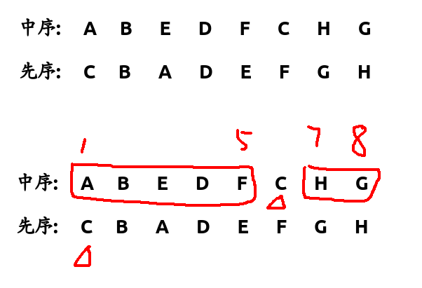

### luogu1827通过Pre和in重建二叉树

> 第一行： 树的中序遍历
>
> 第二行： 同样的树的前序遍历



* 先序的第一个是$root$,然后去中序里找$root$,并把他们分为左右两部分继续递归

```c++
Node* build(int pl, int pr, int il, int ir) {
	Node* ro = new Node(Pre[pl]);
	if(pl == pr) return ro;
	if(pl > pr) return 0;
	int i = il;
	for(i=il; i<=ir; i++) 
		if(In[i] == Pre[pl]) break;
	int lcnt = i-il;
	ro->lef = build(pl+1, pl+lcnt, il, i-1);
	ro->rig = build(pl+lcnt+1, pr, i+1, ir);
	return ro;
}
```


##### 通过中序和后续重建二叉树

##### uva548Tree

> 重建树后求路径和最小的叶子节点

```c++
Node* build(int il, int ir, int al, int ar) {
	Node* ro = 0;
	if(il > ir) return ro;
	if(il == ir) f
      return (ro = new Node(Aft[ar]));
	ro = new Node(Aft[ar]);
	for(int i=il, cnt=0; i<=ir; i++) {
		if(In[i] == ro->val) {
			ro->lef = build(il, i-1, al, al+cnt-1);
			ro->rig = build(i+1, ir, al+cnt, ar-1);
			break;
		}
		cnt ++;
	}
	return ro;
}
```

