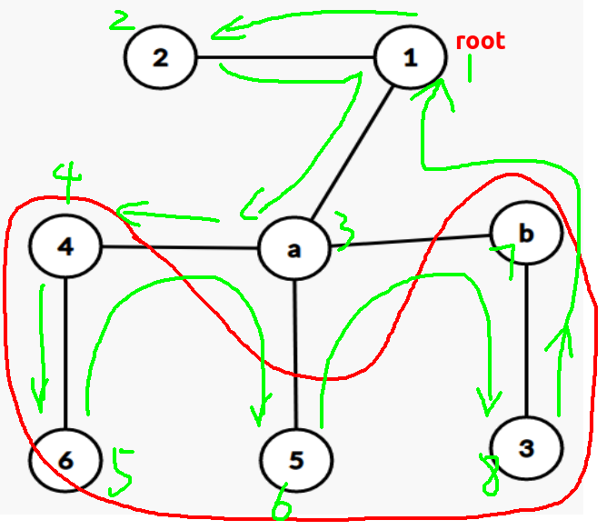
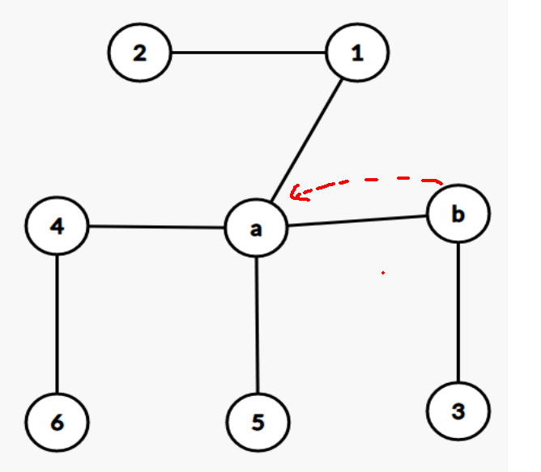
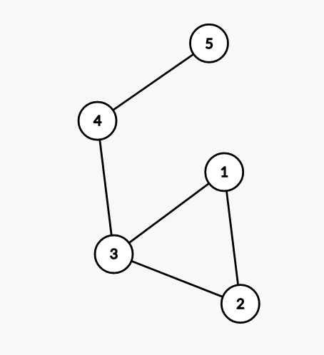
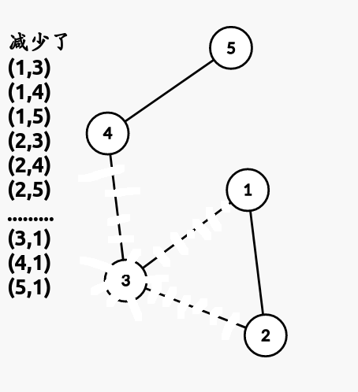

##### 求无向图de割点和桥[视频链接](https://www.bilibili.com/video/BV1Qt41147ih?p=2)

割点 : 设点$u$,删除$u$后图不再联通


割点两种情况 : 

情况一: 点$U$是开始$dfs$的根节点,且有两个以上的子树

情况二: 点$U$是普通节点,且有任意一个儿子点不能翻到$U$点的上面

* 定义$dfn[~]$时间戳数组,表示第一次$dfs$到点$u$的时间

* 定义$low[~]$表示$v$点最早能回溯到的点

* 当$low[V]>=dfn[U]$时,$U$是割点(如果$U$的任意一个子节点$V$存在性质$low[V]>=dfn[U]$则$V$一定是割点)

  

* 如果图有重边,即$b$有$2$条边回到$a$,则$ab$不构成桥,所以要

  $low[b] > dfn[a]才说明$$ab$是桥$

  

* ```c++
  //tarjan割点
  set<int> ans;
  //root是整颗dfs树的根节点
  void tarjan(int u, int root) {
  	dfn[u] = low[u] = ++ timer;
  	int chl_cnt = 0; //记录u的子树个数
  	for(auto v : G[u]) {
  		if(!dfn[v]) {
  			chl_cnt ++;
  			tarjan(v, root);
  			low[u] = min(low[u], low[v]);
  			if(root!=u && low[v]>=dfn[u]) { 
                  //普通节点,情况二
  				ans.insert(u);//u是一个割点
  			}
  		}
          //注意这里是dfn[u]
  		low[u] = min(low[u], dfn[v]);
  	}
  	if(chl_cnt >= 2 && u == root) { 
          //dfs根节点,情况一
  		ans.insert(u);
  	}
  }
  //图有可能一开始就不连通,要跑完全图
  for(int i=1; i<=n; i++) 
    if(!dfn[i]) tarjan(i, i);
  ```

##### luogu3388模板[我的代码](/home/majiao/桌面/Link to 刷题/hdu/第一阶段/Tarjan割点和桥/luogu3388模板/)

##### luogu3469(不会写,好题)

> 给定一张无向图，求每个点被封锁之后有多少个有序点对(x,y)(x!=y,1<=x,y<=n)满足x无法到达y
>
> 
>
> 当删去"3"的时候
>
> 

* 对于非割点: 删去会减少$(n-1)*2$条边
* 对于割点: 删去会使得图变成$K$个联通图
* * 设$num_i$为联通图$K_i$的节点个数(即割点$V_k$的子树$k$的大小)
  * 删去割点$V_k$后的$K$个连通图两两相乘,再相加
  * 即$ans=2(n-1)+\sum_{i=1}^{k}\sum_{j=1}^{k}(num_i*num_j)$
  * 优化   $\because\sum_{j=1}^{k}num_j=n-num_i-1$
  * $\therefore ans=2(n-1)+\sum_{i=1}^{k}(num_i*(n-num_j-1))$


##### POJ1523[链接](http://poj.org/problem?id=1523)

> 求一个无向图删去割点后生成多少个联通分量

* 不知道为啥WA,有重边?

* ```c++
  void tarjan(int u, int root) {
  	dfn[u] = low[u] = ++ timer;
  	int chl_cnt = 0; //记录u的子树个数
  	typedef set<int>::iterator IT;
  	for(IT pv=G[u].begin(); pv!=G[u].end(); pv++) {
  		int v = *pv;
  		if(!dfn[v]) {
  			chl_cnt ++;
  			tarjan(v, root);
  			low[u] = min(low[u], low[v]);
  			if(root != u && low[v] >= dfn[u]) { //普通节点,情况二
  				num[u] ++;
  				flag = true;
  			}
  		}
  		low[u] = min(low[u], dfn[v]);
  	}
  	if(chl_cnt >= 2 && u == root) { //dfs根节点,情况一
  		num[u] ++;
  		flag = true;
  	}
  }
  ```

  ​

