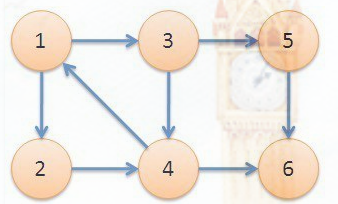
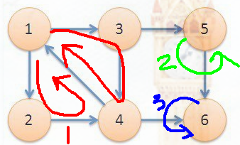
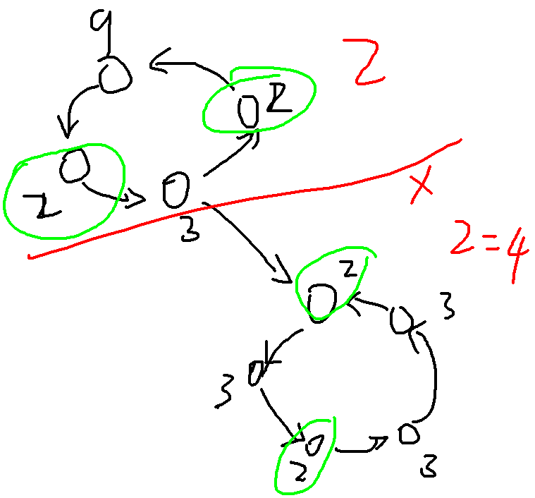
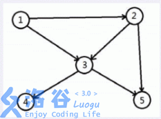

##### Tarjan算法 求强连通分量SCC[博客](https://blog.csdn.net/mengxiang000000/article/details/51672725)

给定一个有向图:

 

强连通分量 : 一个图中任意两个节点$u$和$v$,如果$u$可以到达$v$,且$v$也可以到达$u$,就是强连通($scc$)

于是有3个强连通分量,如下图:



​	

Tarjan算法

* 定义$u$是$v$的父节点


* 定义$dfn[u]$为$dfs$过程中$u$节点的时间戳

* 定义$low[u]$为$u$或$u$的子树能够追溯到的栈中节点最早的时间戳

* $$
  于是得到\\low[u] = min(dfn[u], low[v], dfn[v])
  $$

* **当$low[u]~==~dfn[u]$时$u$为根存在一个强连通**

  ​

```c++
void Tarjan(int u) { //模板
    vis[u]=1;
    low[u]=dfn[u]=cnt++;
    for(int i=0;i<(int)mp[u].size();i++) {
        int v=mp[u][i];
        if(vis[v]==0)Tarjan(v);
        if(vis[v]==1)low[u]=min(low[u],low[v]);
    }
    if(dfn[u]==low[u]) { //当dfn[u]==low[u]u就是强连通分量
        sig++;
    }
}
```


##### Tarjan缩点

* 定义$color[i]$表示节点$i$的颜色

* 定义一个$stack$每次$dfs(u)$时把$u$入栈

* 当发现一个强连通时(即$dfn[u]==low[u]$时), 退栈到$u$并染色

* 建出新图($\color{\red}如何连边~?$ )

* 新图是一个$DAG$, 就可以干很多事,$dp$,最短路,拓扑排序....

  ```c++
  stack<int> stk;
  int color[MAXN];
  void tarjan(int u) {
  	vis[u] = 1;
  	low[u] = dfn[u] = ++cnt;
  	stk.push(u);
  	for(auto v : mp[u]) {
  		if(vis[v] == 0) tarjan(v);
  		if(vis[v] == 1) 
  			low[u] = min(low[u], low[v]);
      }
  	if(low[u] == dfn[u]) { //发现一个强连通
  		sig ++;
  		color[u] = sig; //染色
  		for( ; !stk.empty() ; stk.pop()) {
  			if(stk.top() == u) { 
                stk.pop();
                break;
              }
  			color[stk.top()] = sig;
  			vis[stk.top()] = -1;
  		}
  	}
  }
  ```

  ```c++
  stack<int> stk;
  void tarjan(int u) {
  	instk[u] = 1;
  	stk.push(u);
  	dfn[u] = low[u] = ++timer;
  	for(auto v : G[u]) {
  		if(!dfn[v]) {
  			tarjan(v);
  			low[u] = min(low[u], low[v]);
  		} else if(instk[v]) {
  			low[u] = min(low[u], dfn[v]);
  		}
  	}
  	if(low[u] == dfn[u]) {
  		int x = 0;
  		sig ++;
  		while(x != u) {
  			x = stk.top(); stk.pop();
  			color[x] = sig;
  			instk[x] = 0;
  		}
  	}
  }
  ```

  ​


##### luogu2002消息扩散(缩点板子题[我的代码](/home/majiao/桌面/Link to 刷题/hdu/第一阶段/Tarjan缩点/luogu2002板子题/))

> 有n个城市，中间有单向道路连接，消息会沿着道路扩散，现在给出n个城市及其之间的道路，问至少需要在几个城市发布消息才能让这所有n个城市都得到消息。(有环,自环,给出的图可能是深林)

* 先$Tarjan$缩点,然后统计缩点后的$DAG$入度为$0$的点个数就是答案

  ```c++
  for(int i=1; i<=n; i++) //遍历原图
    for(auto it : G[i]) {
      int u = color[i], v = color[it];
      if(u != v) //消自环
        ind[v] ++; //更新入度
    }
  ```

  ​

##### luoguP3916好题[我的代码](/home/majiao/桌面/Link to 刷题/hdu/第一阶段/Tarjan缩点/luoguP3916缩点+dfs+简单dp/)

> 给出$N$个点，$M$条边的有向图，对于每个点$V_i$，求$A(u)$表示从点$V_i$出发，能到达的编号最大的点。

* 先缩点成$DAG$, 然后$dfs$这个$DAG$(可能有多个入度为$0$的点)
* 设$u$是$v$的父节点, 则$ans[u]=max(ans[u],ans[v])$
* $\color{\red}有一个点TLE了什么鬼...(\\\color{\red}这个测试用例缩点后入度为0的点有13605个)$
* 这道题还可以~~玄学~~正解反向建图然后$dfs$就得出答案$O(N)$


##### luogu1262间谍网(板子题[我的代码](/home/majiao/桌面/Link to 刷题/hdu/第一阶段/Tarjan缩点/luogu1262间谍网络(模板)/))

> 给定一个$N$个点$M$条边的有向图,其中$K$个点可以花费$W_i$元购买,如果$K_i$被购买了,那么沿着$K_i$能遍历到的点都能免费购买,问购买玩所有的点的最少花费是多少?

* 先缩点成$DAG$,对于$DAG$每个入度为$0$的点都必须购买
* 把不能默认购买的点的价格初始化为$INF$
* 如果存在入度为$0$的点的价格为$INF$,就输出$NO$
* 设$DAG$入度为$0$的点为$v$,则$ans=\sum_{i=1}^{sig}v$
* * $程序bug$测试点二 : $N=2901,点1到2900都是可购买的,价格都是100,1$指向每个点,$2900->2899->2897->....->2->1$即:原图没有入度为$0$的点,没有进入$tarjan$里,因此:**要对每个可以被默认购买的点$tarjan$,而不是对原图入度为$0$的点$tarjan$**

  * ```c++
    // 缩点之后,不同颜色的点才连边
    // 即不同强连通分量连上边
    for(int i=1; i<=n; i++)
      for(auto k : G[i]) {
        if(color[i] != color[k]) //不同点才加边 
          ind[color[k]] ++;
      }
    ```


##### luogu2341(好题[我的代码](/home/majiao/桌面/Link to 刷题/hdu/第一阶段/Tarjan缩点/luogu2341/))

> 被所有奶牛喜欢的奶牛就是一头明星奶牛,奶牛之间的“喜欢”是可以传递的——如果 $A$ 喜欢 $B$，$B$ 喜欢 $C$，那么 $A$ 也喜欢 $C$。牛栏里共有 $N$ 头奶牛，给定一些奶牛之间的爱慕关系，请你算出有多少头奶牛可以当明星

* 缩点成$DAG$
* 用$num[~]$记录每个强连通分量的节点个数
* $ans=\sum_{出度==0}DAG里的点$
* **可能存在缩点后有多个出度为$0$的点,此时答案应为0*


##### luogu3387(好题[我的代码](/home/majiao/桌面/Link to 刷题/hdu/第一阶段/Tarjan缩点/luogu3387缩点+拓扑+dp/))

> 给定一个 $N$ 个点 $M$ 条边有向图，每个点有一个权值，求一条路径，使路径经过的点权值之和最大。你只需要求出这个权值和,
>
> 允许多次经过一条边或者一个点，但是，重复经过的点，权值只计算一次。

* 缩点成$DAG$后,可以直接记搜(不会写),也可以拓扑排序+$dp$
* $从前驱节点转移过来,即dp[u]=max(dp[pre]+w[u],dp[u])$


##### luogu2835刻录光盘(简单绿题[我的代码](/home/majiao/桌面/Link to 刷题/hdu/第一阶段/Tarjan缩点/luogu2835简单题/))

* 缩点后统计入度为$0$的scc个数即可


##### luogu2863(水题)

* 缩点后统计scc大小大于$1$的个数即可


##### luogu2746好题([我的代码](/home/majiao/桌面/Link to 刷题/hdu/第一阶段/Tarjan缩点/luogu2746DAG加边成SCC/))

> 给定一个有向图
>
> 1. 求缩点后入度为$0$的点的个数
> 2. 问缩点后最少添加多少条边使得$DAG$可以成为一个SCC

* 对于$2$只需要$ans=max(入度为0的个数,出度为0的个数)$
* 特殊情况 : $DAG$已经是一个$SCC$了,输出$0$


##### luogu2197(好题,乘法原理+缩点[我的代码](/home/majiao/桌面/Link to 刷题/hdu/第一阶段/Tarjan缩点/luogu2197乘法原理+缩点/))

> 给定一个有向图,有点权$W_i$,
>
> 一个强连通分量可以只花费分量里的最小点权$W_{min}$,
>
> 1. $\sum{每个强连通分量的最小花费}$
> 2. 求在1的前提下的最小方案数

* $ans1=\sum_{i=1}^{sig}minN[i],sig是联通分量的个数$
* $乘法原理ans2=\prod_{i=1}^{sig}{SCC里minN[i]的个数}$



* 踩坑 : $ans1不用mod~1e9+7,ans2用$


##### luogu2169([我的代码](/home/majiao/桌面/Link to 刷题/hdu/第一阶段/Tarjan缩点/luogu2169缩点后spfa/))

* 缩点后的$DAG$直接$SPFA$就行了


##### luogu4306连通数(好题,缩点+拓扑序+dp)[代码](/home/majiao/桌面/Link to 刷题/hdu/第一阶段/Tarjan缩点/luogu4306WA/)

> 度量一个有向图联通情况的一个指标是连通数，指图中可达顶点对个的个数。
>
> 
>
> 顶点 1可达 1, 2, 3, 4, 5
>
> 顶点2可达 2, 3, 4, 5
>
> 顶点3可达 3, 4, 5
>
> 顶点 4, 5 都只能到达自身。所以这张图的连通数为 14

* $Tarjan$缩点成$DAG$后,反向建图


* 设$cnt[i]$为第$i$个$SCC$的节点个数,$sig$是$SCC$个数
* $dp[i]=cnt[i]+\sum_{i=1}^{pres}dp[pre]$
* $ans=\sum_{i=1}^{sig}{dp[i]}$
* $WA$最后一个点,原因不明...心态爆炸...直接printf("21")可过


##### luogu2656

##### 采蘑菇(Tarjan+最短路+边权和缩成点权,好题[我的代码](/home/majiao/桌面/Link to 刷题/hdu/第一阶段/Tarjan缩点/luogu2656采蘑菇(tarjan+spfa边权缩成点权)好题/))

> 有向图,有边权,每条边有一个"恢复系数"$K_{uv}$
>
> 边权每次衰减为上一次的"恢复系数$K$"$*$上次权值$W_{lst}$
>
> 第一次经过边$E_{uv}$可以获得边权$W_{uv}1=W_{uv}$
>
> 第二次经过边$E_{uv}$可以获得边权$W_{uv}2=W_{uv}1*K_{uv}$
>
> 第三次经过边$E_{uv}$可以获得边权$W_{uv}3=W_{uv}2*K_{uv}$
>
> 问从$S点$出发最多能获得多少权值

* 缩点成$DAG$

* 对于$SCC$内的边权全部转化为单个$SCC$的点权

  * ```c++
    void build() { //建新图,w2[i]是第i个scc的点权
    	for(int i=1; i<=n; i++) 
    		for(auto k : G[i]) {
    			int u = color[i],
              		v = color[k.to], w = 0;
    			if(u == v) { 
                    //把scc的边权和缩成点权
    				w = parse(k.w, k.xi);
    				w2[u] += w;
    			} else{
    				G2[u].push_back({v, k.w});
    			}
    		}
    }
    ```

* 跑$SPFA$的时候记得加点权


##### luogu2860无向图缩点,好题[无向图和有向图缩点差别博客](https://blog.csdn.net/tianwei0822/article/details/80896098)

> 给定一张无向图,要求在图上添加最少的边,使得所有点都在环上(可以不同环)[我的代码](/home/majiao/桌面/Link to 刷题/hdu/第一阶段/Tarjan缩点/luogu2860无向图缩点不需要instk数组,要多一个fa/)

* 双联通分量 : 分为点双联通,和边双联通

  * 点双联通 : 去掉图中一个点$v$,原图依旧联通,即不存在割点
  * 边双联通 : 去掉图中一条边$e$,原图依旧联通,即不存在桥

* Tarjan无向图缩点,不需要$instk[]$判断,要多一个$fa$参数

  * ```c++
    stack<int> stk;
    void tarjan(int u, int fa=-1) { //无向图要多一个fa
    //	instk[u] = 1; //无向图缩点不需要instk[]判断
    	dfn[u] = low[u] = ++timer;
    	stk.push(u);
    	for(auto v : G[u]) {
    		if(v == fa) continue ;
    		if(!dfn[v]) {
    			tarjan(v, u);
    			low[u] = min(low[u], low[v]);
    		} else {
    			low[u] = min(low[u], dfn[v]);
    		}
    	}
    	if(low[u] == dfn[u]) {
    		int x = 0;
    		sig ++;
    		while(x != u) {
    			x = stk.top(); stk.pop();
    			color[x] = sig;
    //			instk[x] = 0; ////无向图缩点不需要instk[]判断
    		}
    	}
    }
    ```

* 有重边,用$set<int>~G[~]$存图


##### luogu3627(没$AC$,大佬缩点+spfa过,我bfs和dfs都被卡)

> 给定一个有向图,有些点用双圈表示,有点权
>
> 求从点$S$开始走到达双圈点,能获得的最大点权和

* 缩点成$DAG$,如果$scc$里有双圈,则这个$scc$也用双圈表示

* $SCC_{双圈i}=max(SCC_{pre})$

  $ans=max(SCC_{双圈})$

* 对$DAG$进行$dfs$爆栈$TLE$了,开$O_2$都救不回来???

* $bfs$竟然$MLE$了$5e5$的点竟然能榨干$128MB$????

* 数据有重边,所以Tarjan递归了10万层,爆栈了,打出$GG​$

* **话说回来,如何把点权缩到边权上,再spfa???**

* $DAG$加上一个源点汇点,所有双圈指向汇点,点权转移到边,就可以$spfa$[我的代码](/home/majiao/桌面/Link to 刷题/hdu/第一阶段/Tarjan缩点/luogu3627加源点汇点点权化边权spfa/)

* 为什么$bfs+dp$会$WA3$个点??