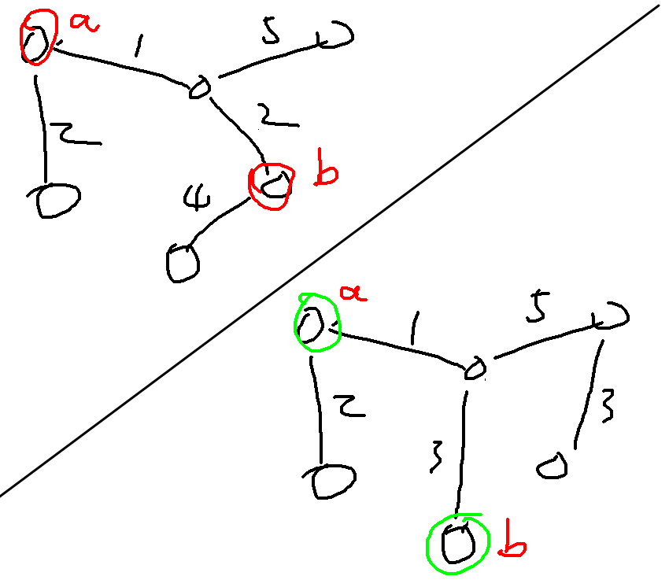
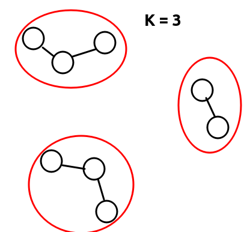

##### 最小生成树

性质 : 

1. 定义在一棵树里添加一条边，并在产生的圈里删除一条边叫做一次操作。（也就是说换掉一条边并且保证结果是树），则树A和B是无向图的两个生成树，则A可以通过若干次操作变成B。
2. 把一个连通无向图的生成树边按权值递增排序，称排好序的边权列表为有序边权列表，则任意两棵最小生成树的有序边权列表是相同的。**（算法导论23.1-8）**
3. A,B是同一个无向连通图的两棵不同的最小生成树，则A可以通过若干次（1）中定义的换边操作，并且保证每次结果仍然是最小生成树，最终转换成B。
4. 一个连通无向图G,不会有一棵最小生成树包含G的一个圈中全部最大权值的边。
5. 对于一个连通无向图的生成树，只考虑它的边权，形成的有序边权列表中，最小生成树是有序边权列表字典序最小的。（字典序就是通常的定义，两个序列A,B的字典序相同当且仅当A=B。否则，序列A,B出现最早位置的不相等的元素时，如果序列A的该位置元素更小，则序列A字典序小，反之，则序列B的字典序更小。如果直到一个序列结束都没有这样的位置，则较短的序列字典序小）
6. 一棵树不是最小生成树，则一定存在一个（1）中描述的操作，使得操作之后，它的总权值减小。
7. 一棵生成树不是最小生成树，则一定存在（1）中的操作，不断进行把它转换成一棵最小生成树，而且每次操作后权树的总权值都会减小。
8. 如果一棵生成树，任何边都在某棵最小生成树上，则它不一定是最小生成树。

> 设 G=(V,E) 是一个带边权的连通无向图。设 T1,T2 是 G 的两棵最小生成树，则对于任意两点 u,v∈V，「T1 中路径 u,v 上边的最大权值」与「T2 中路径 u,v 上边的最大权值」相等。
>
> 这个表述是不是有问题 ?
>
> 

##### kruskal

* 把边按边权排序,得到**有序边权列表**

* 利用并查集判断**安全边**,并添加到当前生成树里

* **注意到: 有序边权列表具有单调性,可以搞二分**

  * 洛谷上有一道题就是利用这个单调性做的

  * > 给定一个图,有边权,边分为白边和黑边,求一个最小生成树
    >
    > 且Tree恰好有$K$条白边

    * 对于每条白边,边权加上偏移量$x$
    * 于是排序后,所有白边会整体后移,或整体前移
    * 二分这个偏移量$x$

##### luogu1396[我的代码](/home/majiao/桌面/Link to 刷题/hdu/第一阶段/krusxxx最小生成树/luogu1396/)

> 给定一个图,有边权,求源点$S$到汇点$T$的一条路径$path$,
>
> 要求该路径$path$的最大边权最小

* 直接求最小生成树,当$S$和$T$联通时,即得答案
* 还可以二分答案+$bfs$,$check$是否可以到达汇点​[代码](/home/majiao/桌面/Link to 刷题/hdu/第一阶段/二分查找/luogu1396二分边权/)

##### luogu4047部落划分[代码](/home/majiao/my_mount/Xubuntu_Work_Space/From_Xubuntu/codeTest_2019_2_21/刷题/hdu/第一阶段/最小生成树/luogu4047好题)

> 给定二维平面上$N$个点,要求划分成$K$个联通块,
>
> 使得靠的最近的两个联通快尽可能远离
>
> 题目的意思很简单给你给出n个点，让你划分成m个集合。现在问你集合之
> 间最短距离最大是多少

* 数据虚标,krusxxx卡过去了...
* 如图krusxxxx生成MST的过程中会先把近的连起来
* 
* 再任意连一条边就是答案
* 即联通快个数减少到$K-1$个时的那条边就是答案
* 有大佬二分答案...什么鬼....看不懂的思路...