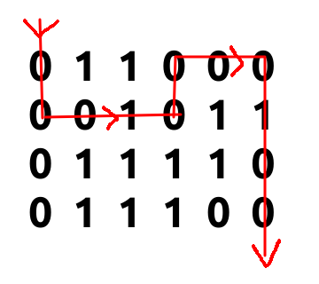

最短路spfa板子

```c++
struct Edge {
	int to, val;
	Edge(int _to=0, int _val=0) 
      : to(_to), val(_val) { }
};
vector<Edge> G[MAXN];
int spfa() {
	queue<int> q;
	for(int i=0; i<=n; i++) d[i] = INF;
	q.push(1), vis[1] = true, d[1] = 0;
	while(!q.empty()) {
		int now = q.front(); q.pop();
		vis[now] = false;
        //松弛每条边
		for(int i=0; i<G[now].size(); i++) {
			int v = G[now][i].to,
          		td = G[now][i].val;
			if(d[v] > d[now]+td) {
				d[v] = d[now] + td;
				if(vis[v]) continue ;
				vis[v] = true;
				q.push(v);
			}
		}
	}
	return d[n];
}
```

Floyd板子

```c++
for(int k=1; k<=n; k++)
  for(int i=1; i<=n; i++)
    for(int j=1; j<=n; j++)
      mp[i][j] = min(mp[i][j], 
                     mp[k][i]+mp[k][j]);
printf("%d\n", mp[1][n]);
```

dijkstra+堆优化

```c++
while(cin >> n >> m) {
  init();
  for(int i=0; i<m; i++) {
    int x, y, z;
    scanf("%d %d %d", &x, &y, &z);
    E[x].push_back(make_pair(y, z));
    E[y].push_back(make_pair(x, z));
  }
  int s, t;
  scanf("%d %d", &s, &t);
  priority_queue<pair<int, int> > Q;
  Q.push(make_pair(-d[s],s)), d[s] = 0;
  while(!Q.empty()) { //dijkstra+堆优化
    int now = Q.top().second;
    Q.pop();
    for(int i=0; i<(int)E[now].size(); i++) {
      int v = E[now][i].first;
      if(d[v] > d[now]+E[now][i].second) { //松弛
        d[v] = d[now] + E[now][i].second;
        Q.push(make_pair(-d[v], v));
      }
    }
  }

  if(d[t] == 1e9) printf("-1\n");
  else printf("%d\n", d[t]);
}
```


##### uva1599理想路径(好题)[代码](/home/majiao/my_mount/Xubuntu_Work_Space/From_Xubuntu/codeTest_2019_2_21/刷题/hdu/第一阶段/最短路径/spfa/uva1599理想路径)

> 给定一个n个点m条边的无向图，每条边上都涂有1种颜色。求点1到点n的一条路径，**使得经过的边数最少**，在此前提下，经过边的颜色序列最小。可能有自环与重边。输入保证至少存在一条连接1和n的道路。

* 先spfa求n到各个点的最短路
* 再从起点BFS,对于每一层d[u]如果等于上一层d[v]+1就记录ans


##### uva1600巡逻机器人(地图bfs)[代码](/home/majiao/my_mount/Xubuntu_Work_Space/From_Xubuntu/codeTest_2019_2_21/刷题/hdu/第一阶段/bfs/uva1600巡逻机器人bfs剪枝)

> 一个n*m的地图,0是通路,1是障碍,一个机器人要从左上角走到右下角,机器人最多可以**连续**经过k个障碍物,求最小步数
>
> 当k=1时如下图,答案为10



* 对于每个格子可以重复,所以去掉vis[ ]数组
* 由于bfs的特性,到达同一个格子的步数一定相同,但是跨过的障碍数不一定相同, 可以知道，当然是已经跨越的障碍越少越好
* 开一个计数数组$cnt[~][~]$记录每个格子的剩余最大通过连续障碍数
* 剪枝,剪去到当前格子剩余步数最小的路径