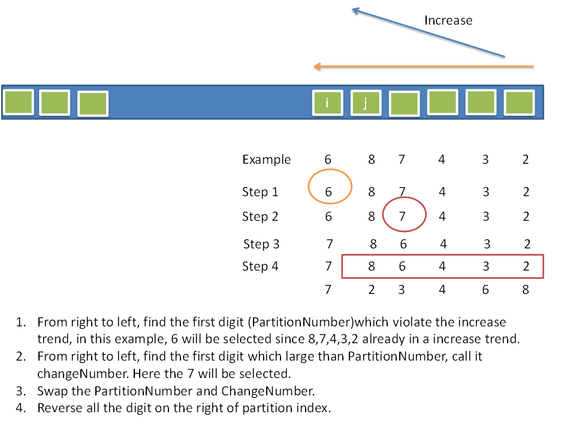

##### luogu4305拉链法哈希

* vector<int> hash[MAXN]


##### luogu3913使用std::unique去重比set快的多


##### luogu2036 搜索n个数字中的k个数字 使得k个数字和绝对值最小

+ 先求差值数组 再求子集中和的绝对值最小dfs

+ **只能dfs 不要去想玄学  枚举每个数字选或者不选两种状态**

+ **用二进制优化**

+ ```c++
  void dfs() {
  	int N = 1<<n;
  	for(int i=1; i<N; i++) {
  		int sa = 1, sb = 0;
  		for(int k=0; k<n; k++) 
  			if((i>>k) & 1) {
  				sa *= a[k+1];
  				sb += b[k+1];
  			}
  		ans = min(ans, abs(sa-sb));
  	}
  }
  ```


##### luogu1088 下一个排列$\color{\red}好题$

> 求一个排列的第k个排列(k很小)

* 可以用STL next_permutation(begin, end) 水过去
* 关于next_permutation
* 
* * 找右向左找第一个违背递增的位置 记为$~i$
  * 找右向左找第一个大于$num[i]$的数记为$~k$, 
  * 交换$i,k$ $swap(num[i], num)$
  * 最后把 $[i+1, ~n]$ 逆序


##### luogu1036选数(dfs经典题)

> 从N个数字中选K个
>
> ```c++
> void dfs(int level, int sum) {
> 	if(level > m) {
> 		if(is_prime(sum)) ans ++;
> 		return ;
> 	}
> 	for(int i=level; i<=n; i++) { //不降原则
> 		if(vis[i] || i<rs[level-1]) continue ;
> 		vis[i] = true;
> 		rs[level] = i;
> 		dfs(level+1, sum+a[i]);
> 		vis[i] = false;
> 	}
> }
> ```
>


##### luogu1618三连击

* 不知道为什么要用$j=i/a*b,  k=i/a*c$
* 不知道为什么要特判$123~456~789$


##### 2020-3-11 luogu3799排列组合好题

> 有n根木棒，现在从中选***4***根，想要组成一个正三角形，问有几种选法？

* 可以发现一定有**2**根是等长的X，剩下**2**根的长度和为(Y+Z) = X

* 枚举X ,Y， 求他们的排列组合**注意模1e9+7**

$$
第一层for枚举5000内的长度X~对于X~tmp=C_{cnt[X]}^{2}\\
~~ 第二层for枚举Y~ans+=tmp*C_{cnt[Y]}^{1}*C_{cnt[X-Y]}^{1}
$$


##### 2020-3-10  luogu2241统计方块(好题)

> **求n*m的网格中的长方形,正方形的个数**

* **先排列组合求 矩形 的个数X = $C_{N+1}^{2}~*~C_{M+1}^{2}$**


* **公式 $C_{N}^{2} = \frac{N*(N-1)}{2}$**
* $C_{N+1}^{2}~*~C_{M+1}^{2}$ = $(\frac{(M+1)*M}{2}) * (\frac{(N+1)*N}{2})$
* 对于一个边长为i的正方形有$(N-i+1)*(M-i+1)$ 种放置方法, 所以


$$
正方形个数~ = ~\sum_{i=1}^{min(N, M)} {(N-i+1)*(M-i+1)}
$$

* 最后正方形个数y,  长方形个数(x-y)


##### luogu1012贪心

> 给定多个数字,把他们拼成一个最大的数字
>
> 13, 312, 343可以拼成34331213 
>
> + 先排序,打印排好序的数组就行
>
> + ```c++
>   bool cmp(string& x, string& y) { 
>   return x+y > y+x;
>   }
>   ```


##### luogu5143大水题 

> 按z坐标排序,把距离加起来就行了

$$
三维点的公式距离
\sqrt{(x_i-x_j)^2+(y_i-y_j)^2+(z_i-z_j)^2}
$$


##### 2020-3-9 luogu1923[好题]  区间k小值$\color{red}注意$

> **给定5e6个数字, 求第k小的值(k从0开始)**
>
> + ~~维护一个堆,开O2卡过去了~~
> + $\color{red}正解是用快排原理+分治  或主席树(未看懂)$
> + **或者用STL神奇的nth_element(begin,nth,end,compare);**


##### 2020-3-9 luogu1271[深基] 选举学生会

> **桶排序 就是统计每个数字的出现次数 然后打印**


##### 2020-3-9 luoguP1563 玩具小人藏眼镜

> **模拟好题(~~歌上唱有~~)  围成圈的小人 有人向里,有人向外**
>
> **如果一个人向外,则他的左右要反过来(可以用亦或取反)**
>
> ```c++
> while(m--) {
> 	int K, dir;
> 	scanf("%d %d ", &dir, &K);
> 	K %= n;
> 	if(a[now].dir) //如果朝外,就把左右调换
>       dir = !dir;
> 	if(RIG(dir)) //右加左减
> 		now = (now+K) % n;
> 	 else 
> 		now = (now+n-K) % n;
> }
> ```
>
> 


##### 2020-3-9   luogu1042

> **模拟好题目,坑点很多**
>
> + 'E' 在开头,即比赛未开始 也要打印0:0 0:0
> + 11个球 第一局刚好结束,第二局要打印0:0


##### 2020-3-9    luogu1217 

> **找出一亿里的回文质数(101,131,151,181 ...) **
>
> * 先找回文数, 再判断是不是质素
>
> * 产生回文数方法
>
> * ```c++
>   for (d1 = 1; d1 <= 9; d1+=2) {    // 只有奇数才会是素数
>   for (d2 = 0; d2 <= 9; d2++) {
>   for (d3 = 0; d3 <= 9; d3++) {
>   num = 10000*d1 + 1000*d2 +100*d3 + 10*d2 + d1;//(处理回文数...)
>   }
>   }
>   }
>   ```
> ```
>
> * ```c++
> void dfs(int now, int level) { //回文数字的搜索 有点问题 缺个11 特判一下
> if(level > max_level) {
> int tmp = now/10, num = now;
> while(tmp) {
> 	num = num * 10 + (tmp%10);
> 	tmp /= 10;
> }
> if(check(num)) que.push(num);
> return ;
> }
> for(int i=0; i<10; i++) {
> dfs(now*10 + i, level+1);
> } 
> }
> ```
> ```
>
> ```
>
> ```
>
> ```


#####  UVA1590 IP网络[我的代码](/home/majiao/my_mount/Xubuntu_Work_Space/From_Xubuntu/codeTest_2019_2_21/刷题/luogu/uva1590ip地址) 

> 给定多个子网ip,求子网最小ip,和子网掩码
>
> 子网掩码又32位01串组成,左边全1,右边全0

* $ans1$可以由任意一个子网ip和掩码[按位与]得到
* 写到自闭..............


##### uva10815set的使用,有穷状态机找单词

> 给定一篇文章,有标点符号,括号,双引号,字母
>
> 把所有单词按字典序打印(并且全部转成小写)

* 状态机判断是否是单词,起始状态在单词外,遇到字母转换状态
* 从"在单词外"转换到"单词内"即得到一个单词


##### uva12096 队列

> 对于一个以集合为元素的栈，初始时栈为空。
> 输入的命令有如下几种：
> PUSH：将空集{}压栈
> DUP：将栈顶元素复制一份压入栈中
> UNION：先进行两次弹栈，将获得的集合A和B取并集，将结果压栈
> INTERSECTION：先进行两次弹栈，将获得的集合A和B取交集，将结果压栈
> ADD：先进行两次弹栈，将获得的集合A和B中，先出栈的集合（如A先）加入到后出栈的集合，将结果压栈
> 输出每一步操作后栈顶集合的元素的个数。

* 使用map<Set,int>映射,然后应模拟即可
* 关键是Set+map那一块不容易想到[代码](/home/majiao/桌面/Link to 刷题/hdu/第一阶段/stack/uva12096SetStack紫树好题/)


##### uva10763交换学生

> 有n(1≤n≤500000)个学生想交换到其他学校学习。规定每个想从A学校换到B学校的学生必须找一个想从B换到A的“搭档”。每个人都找到搭档输出“YES”,否则输出“NO”.

* 两个数组记录进出人数,进出人数不等就NO


##### uva10391复合词

> 给出$N$个单词集合,输出集合里所有的复合词
>
> 复合词 : 用集合里两个单词拼成的单词

* 先用set存,枚举每个单词的分界点mid复合就输出
* 可惜120000个单词,不然就能练习一下Trie树了


##### UVA12100队列和堆好题

> 学生会里只有一台打印机，但是有很多文件需要打印，因此打印任务不可避免地需要等待。有些打印任务比较急，有些不那么急，所以每个任务都有一个1～9间的优先级，优先级越高表示任务越急。
>
> 打印机的运作方式如下：首先从打印队列里取出一个任务J，如果队列里有比J更急的任务，则直接把J放到打印队列尾部，否则打印任务J（此时不会把它放回打印队列）。输入打印队列中各个任务的优先级以及所关注的任务在队列中的位置（队首位置为0），输出该任务完成的时刻。所有任务都需要1分钟打印。例如，打印队列为{1,1,9,1,1,1}，目前处于队首的任务最终完成时刻为5。
>
> 输入T接下来T组数据每组数据输入N，TOP。接下来N个数，TOP代表队列首

* 用栈或堆放优先级,再用deque模拟即可[代码](/home/majiao/my_mount/Xubuntu_Work_Space/From_Xubuntu/codeTest_2019_2_21/刷题/hdu/第一阶段/deque/uva12100模拟)


##### 矩阵连乘 栈好题[代码](/home/majiao/my_mount/Xubuntu_Work_Space/From_Xubuntu/codeTest_2019_2_21/刷题/hdu/第一阶段/stack/uva442矩阵连乘)

> 给定n个矩阵,对于两个矩阵$A和B$,如果$A$的$c$和$B$的$r$相等,就可以乘,给定形如((((AB)C)D)(EF))的字符串,判断可以乘几步

* 用栈存矩阵,不满足乘法条件直接输出$error$


##### uva297四分树[代码]()

> 给定四分树的先序遍历可以还原整棵树

```c++
void dfs(char* s, int& idx, int r1, int c1, int w) {
	if(!s[idx]) return ;
	if(s[idx] == 'f') {
		for(int i=r1; i<r1+w; i++)
			for(int k=c1; k<c1+w; k++)
				color[i][k] = true;
		return ;
	}
	if(s[idx] == 'p') {
		dfs(s, (++idx), r1, c1+w/2, w/2);
		dfs(s, (++idx), r1, c1, w/2);
		dfs(s, (++idx), r1+w/2, c1, w/2);
		dfs(s, (++idx), r1+w/2, c1+w/2, w/2);
	}
}
```


##### uva10562看图写树[代码](/home/majiao/my_mount/Xubuntu_Work_Space/From_Xubuntu/codeTest_2019_2_21/刷题/hdu/第一阶段/dfs/uva10562看图写树)

##### uva806四分树[代码](/home/majiao/my_mount/Xubuntu_Work_Space/From_Xubuntu/codeTest_2019_2_21/刷题/hdu/第一阶段/dfs/uva806四分树)

> 给定01矩阵或者10进制数
>
> * 把01矩阵按四分树切分,然后写成十进制数打印
> * 十进制数转五进制01矩阵

* 下标从0开始build(r, c, w), build(r+w/2, c, w/2)....