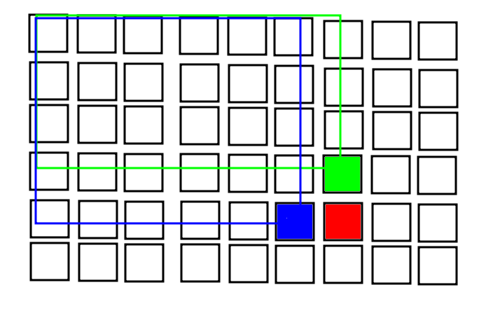

与一维类似 

稀疏矩阵时 二维bit可以用四分树代替(例如pta的道毒瘤35分题)

* 更新

  ```c++
  void update(int i, int k, int x) {
  	for( ; i<=n; i+=lowbit(i))
  		for(int j=k; j<=n; j+=lowbit(j))
  			tree[i][j] += x;
  }
  ```

* 修改

  ```c++
  int query(int x, int y) {
  	int ans = 0;
  	for(int i=x; i>0; i-=lowbit(i))
  		for(int k=y; k>0; k-=lowbit(k))
  			ans += tree[i][k];
  	return ans;
  }
  ```

* 求和  ( 类似于二维前缀和 )

  ```c++
  int sum = (query(x2, y2) + query(x1 - 1, y1 - 1) - query(x1 - 1, y2) - query(x2, y1 - 1)) ;
  ```

  

牛客15172[情人节的电灯泡](https://ac.nowcoder.com/acm/problem/15172) [代码](/home/majiao/my_mount/Xubuntu_Work_Space/From_Xubuntu/codeTest_2019_2_21/刷题/笔记/树状数组笔记/代码/hdu1166模板)