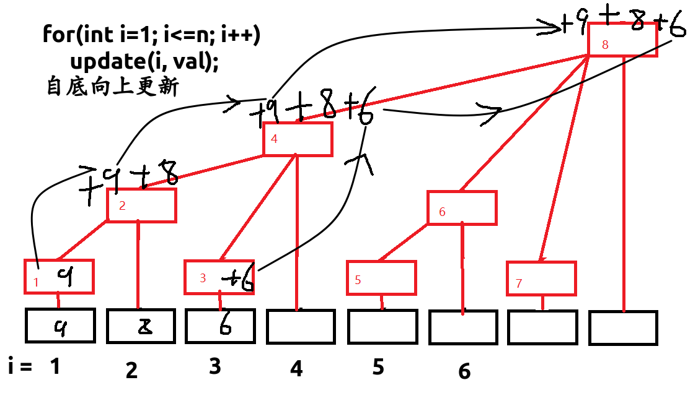
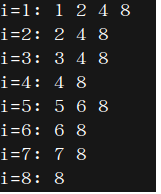
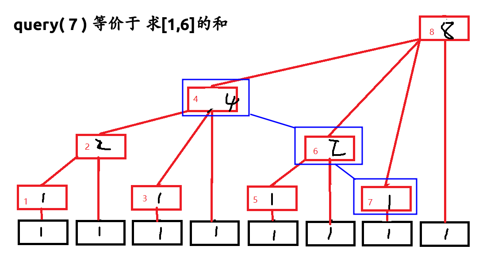

树状数组如下图



* $$ lowbit(x)=>(x\&(-x)) $$

  > lowbit(i, val)
  >
  > ​
  >
  > 如图: 
  >
  > ​

* 更新update(i, val)

  ```c++
  //如上图,节点i就是[1,i]的前缀和
  void update(int i, int val) {
  	while(i <= n) {
  		tree[i] += val;
  		i += lowbit(i);
  	}
  }
  ```

* 查询query( i )

  

  ```c++
  int query(int i) { //求[1,i-1]的前缀和
  	int ret = 0;
  	while(i > 0) {
  		ret += tree[i];
  		i -= lowbit(i);
  	}
  	return ret;
  }
  //求区间[L,R]的和
  query(R)-query(L-1);
  ```

  ​

hdu1166单点加区间求和模板[代码](/home/majiao/my_mount/Xubuntu_Work_Space/From_Xubuntu/codeTest_2019_2_21/刷题/笔记/树状数组笔记/代码/hdu1166模板)