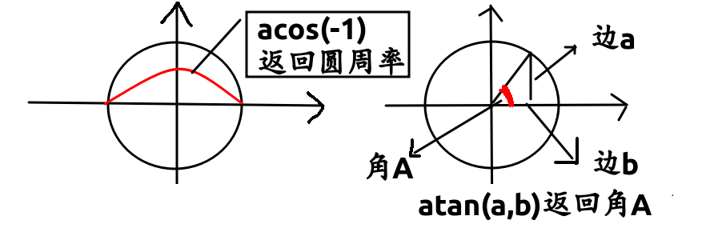
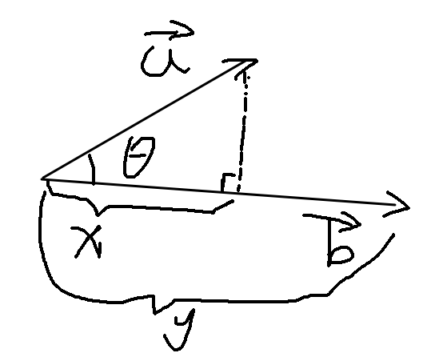
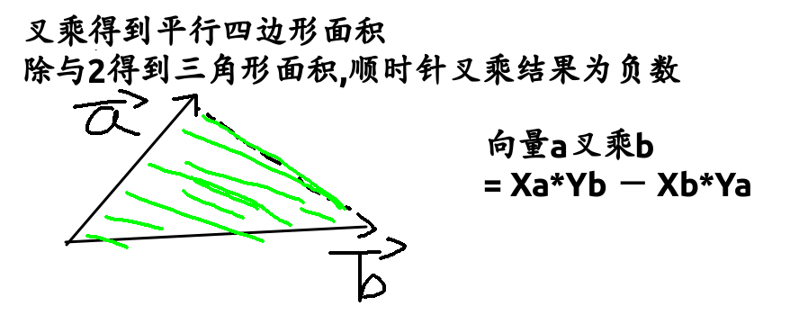
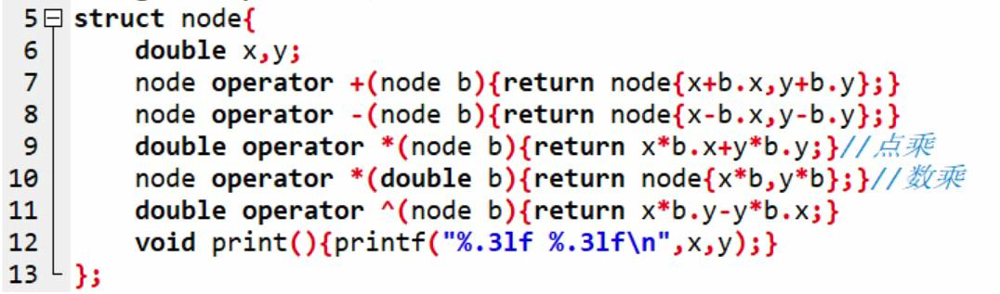

* $$acos(-1)$$返回圆周率3.14159
* $$atan2(a,b)$$
* 

* 向量
  * 加减法: 横坐标相加减法,纵坐标相加减
  * 乘法: $$\vec a 乘x,就是把\vec a延长x倍$$
  * **点乘: $$\vec a \cdot \vec b = |\vec a||\vec b|* cos\theta$$ **
    * 点乘结果是一个向量在另一个向量方向上投影的长度,是一个标量
  * 
  * **叉乘: $$\vec a*\vec b=Xa*Yb-Xb*Ya$$**
    * ​
  * 
* 

