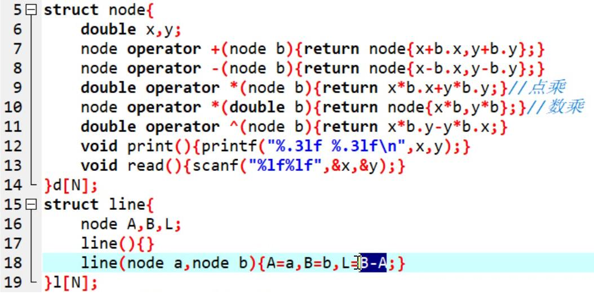

基本代码




求多边形面积

* 逆时针叉积n个点,把point[n+1]=point[1]可以避免取模

  ```c++
  struct Node {
  	double x, y;
  	Node operator + (Node& no) { 
        return Node{x+no.x, y+no.y};
      }
  	Node operator - (Node& no) { 
        return Node{x-no.x, y-no.y};
      }
  	double operator ^ (Node& no) { 
        return x*no.y - y*no.x;
      } //叉积
  } d[MAXN];
  //main里面
  d[n+1] = d[1];
  double ans = 0;
  for(int i=1; i<=n; i++) 
    ans += (d[i] ^ d[i+1]);
  printf("%.1lf\n", fabs(ans)/2); //别忘了除于2
  ```

* luogu1183[代码](/home/majiao/my_mount/Xubuntu_Work_Space/From_Xubuntu/codeTest_2019_2_21/刷题/笔记/计算几何笔记/代码/luogu1183多边形面积)