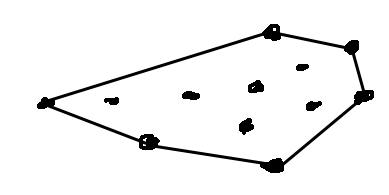
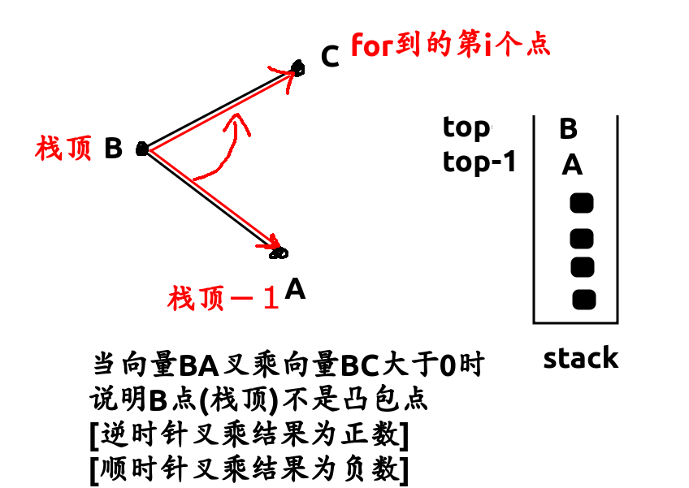

凸包定义: n个点,最外面的那一圈点组成的多边形



求凸包方法

* 先极角排序

  ```c++
  //stk[1]是最左下角的点,
  //读入数据的是否要先筛选出来
  bool cmp(node& p1, node& p2) {
  	return (p1-a[stk[1]])*(p2-a[stk[1]]) > 0;
  }
  sort(a+2, a+1+n, cmp);
  ```

* 从最左下角的点开始构造

  ```c++
  for(int i=2; i<=n; i++) {
    while(top>1 &&
          (a[stk[top-1]]-a[stk[top]])*(a[i]-a[stk[top]]) > 0)
      -- top; //核心,把不属于凸包的点弹栈
    stk[++top] = i;
  }
  ```

  

* 最后栈内的点就是凸包点


luoguP2742圈奶牛[代码](/home/majiao/my_mount/Xubuntu_Work_Space/From_Xubuntu/codeTest_2019_2_21/刷题/笔记/计算几何笔记/代码/luogu2742凸包周长)