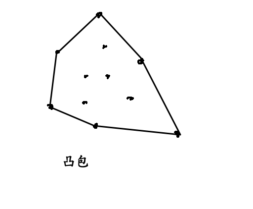
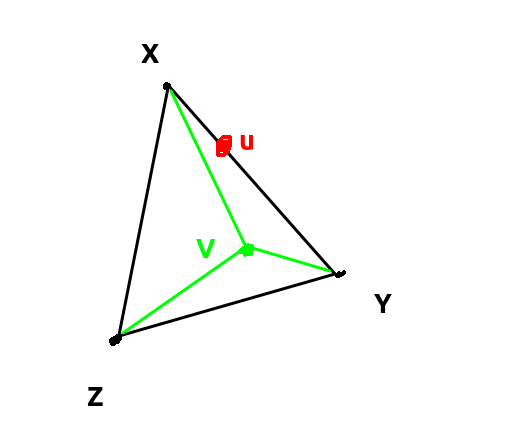
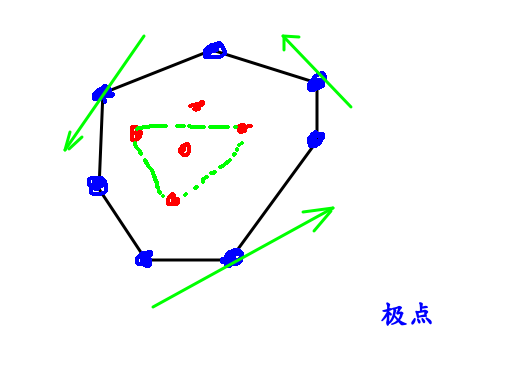
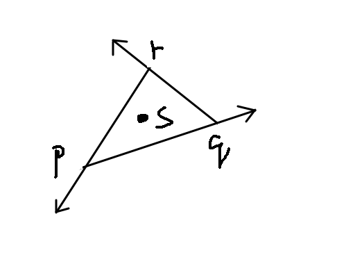
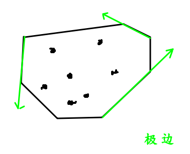

[清华大学邓俊辉课程](https://www.bilibili.com/video/av92833829?p=7)

### 一 : 凸包(核心问题)




> **问题给定三种原始颜料x(10, 35),  y(16, 20), z(07, 15)**
>
> **请尝试调和出颜色U(12, 30)和颜色V(13, 22)**

+ 把x, y, z在三维空间中画出来如下

  

凸相关概念: **三点共线**


### P10如何构造一个凸包

### 算法一 :



**类似冒泡算法(效率低O(N^4))**

$\color{red}就是判断每个点是否会位于某个三角形内部$
$$

$$

$$
伪代码:   
开始时假设所有点都是极点  \\
for~each ~~\triangle(p, q,r)\\
~~~for~each~~\triangle(p, q, r)\\
~~~~~~~~~~~~~~~~~~~if~~s~\in~\triangle(p, q, r)~~then\\
~~~~~~~~标记为非极点
$$

```c++
//判断点s是否在三角形pqr内, 转化为3次ToLeft测试
#define Point P
bool InTriangle(P p, P q, P r, P s) {
  bool pqLeft = ToLeft(p, q, s);
  bool qrLeft = ToLeft(q, r, s);
  bool rpLeft = ToLeft(r, p, s);
  return (pqLeft==qrLeft) && (qrLeft==rpLeft);
}
```



* 看图可知当s在三条直线的左边时s才在三角形pqr内

```c++
bool ToLeft(P p, P q, P r, P s) {
  return Area2(p, q, s) > 0;
}
int Area2(P p, P q, P r, P s) {
  return p.x * q.y - p.y * q.x
       + q.x * s.y - q.y * s.x
       + s.x * p.y - s.y * p.x; 
}
```


```c++
void extremePoint(Point S[], int n) { //n > 2
  for(int s=0; s<n; s++) S[s].extreme = true;
  for(itn p=0; p<n; p++)
    for(int q=p+1; q<n; q++)
      for(int r=q+1; r<n; r++) {
        if(s==p || s==q || s==r || !S[s].extreme) continue ;
        if(InTriangle(S[p], S[q], S[r], S[s])) 
          S[s].extreme = false;
      }
}
```


### 算法二 : EE  O(n^3) [P13](https://www.bilibili.com/video/av92833829?p=13)

**找极边**




```c++
void markEE(Point S[], int n) {
  for(int k=0; k<n; k++)
    S[k].extreme = false;
  for(int p=0; p<n; p++) //枚举所有直线
    for(int q=p+1; q<n; q++)
      checkEdge(S, n, q, p); //判断是否是极边
}

void checkEdge(Point S[], int n, int p, int q) {
  bool LEmpty=true, REmpty=true;
  for(int k=0; k<n && (LEmpty||REmpty); k++) 
    if(k!=p && k!=q)
      ToLeft(S[p], S[q], S[k]) ? (LEmpty=false) : (REmpty=false);
  
  if(LEmpty && REmpty) 
    S[p].extreme = S[q].extreme = true;
}
```

'

### 算法三 (常用)[P18](https://www.bilibili.com/video/av92833829?p=18)

** 挨个插入点s,并判断s是否在上一个凸包内 **


'[目前进度](https://www.bilibili.com/video/av92833829?p=18)

